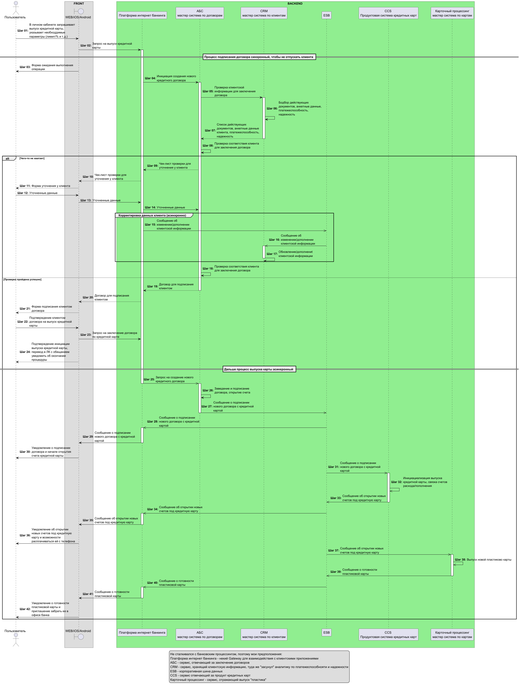
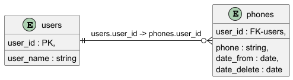

# Техническое задание
## 1. Отрисуйте процесс выдачи кредитной карты, которую клиент заказывает в онлайне (сайт или интернет банк) с использование следующих систем:

-  Платформа интернет банкинга
-  CCS (Продуктовая система кредитных карт)
-  АБС (мастер система по договорам)
-  CRM (мастер система по клиентам)
-  Карточный процессинг (мастер система по картам) 
-  ESB 
-  Фронтовые компоненты

Желательно использовать различные способы интеграции, с учетом нагрузки. Желательно с использованием диаграммы последовательностей.

**Ответ**
[Sequence](Sequence_Credit_card.puml)



## 2. Необходимо спроектировать rest-метод аутентификации пользователя.

Есть экранная форма с 2 полями login и password. Необходимо спроектировать rest-метод аутентификации пользователя, который будет принимать значения полей и возвращать bearer Token. Требуется только ответить на вопрос "Как будет выглядеть HTTP запрос для аунтетификации пользователя?". Действия сервиса при вызове этого метода описывать нет необходимости.

**Ответ**

````
POST https://bankname.ru/oauth/login

-header 'content-type: application/x-www-form-urlencoded'
-data type=LOGIN
-data grant_type=password
-data client_id=Evo-UI
-data username={username} # логин от личного кабинета клиента
-data password={password} # пароль от личного кабинета клиента
````

Response

````
{
  "access_token": "eyJhbGciOiJIUzI1Ni...",
  "token_type": "bearer",
  "refresh_token": "eyJhbGciOiJIUzI1Ni...",
  "expires_in": 1799,
  "scope": "read write purchase",
  "X-Fingerprint": "29798b7854277c53f3fbab4efe8afbdf",
  "x_user_id": "f0b40dab-28a3-449c-896d-1c8b594a5662",
  "x_uid": null,
  "iat": 1597320746126,
  "x_longlived": false,
  "jti": "92a0aa4e-36b3-48bd-adfc-4d9139519a3f"
}
````

## 3. Спроектировать модель хранения.

У одного пользователя n номеров телефонов. 1 номер телефона может принадлежать только 1 пользователю. Спроектировать модель хранения. Указать наименования таблиц, их атрибуты, первичные и внешние ключи.

**Ответ**
[ERD](ERD.Phone.puml)



## 4. В каких случаях и для чего используются очереди сообщений?

**Ответ**
Для разделения сложных процессов обработки, для буферизации или организации пакетной обработки, а также для сглаживания пиковых нагрузок.

5. Какие инструменты используете для тестирования веб сервисов?

**Ответ**
SoapUI, Postman, Swagger, браузер